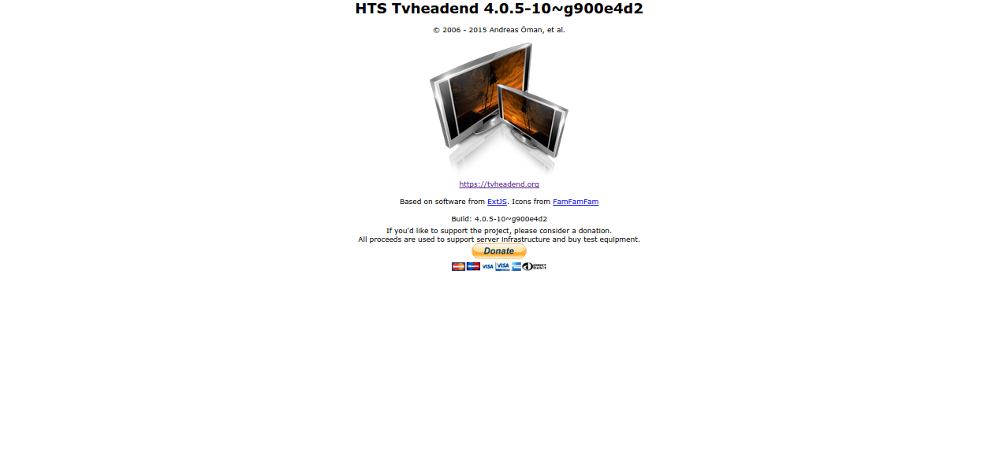

##About

This tab gives you basic information about Tvheadend's copyright, the authors,
licensing, etc.

<tvhversion from="4.2">
You can also check the build options for your binary by clicking *Toggle details*.
</tvhversion>

Oh, and you can make a donation as well, of course :)

For more information about Tvheadend, please visit [our home page](https://tvheadend.org/),
read [the full online documentation](http://docs.tvheadend.org/) or just 
cut straight to [the FAQs](http://docs.tvheadend.org/Appendices/faqs/).
