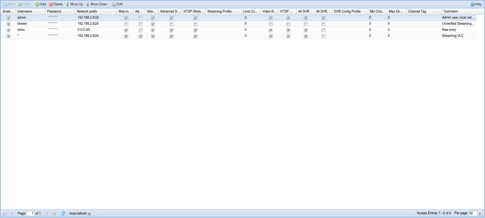
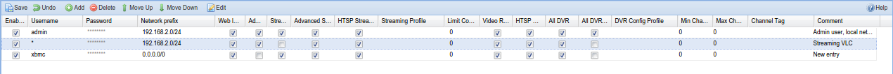

##Configuration - Access Entries

Setting up access control is an important initial step as **<u>the system
is initially wide open</u>**. 

Tvheadend verifies access by scanning through all enabled access control
entries in sequence, from the top of the list to the bottom. The permission
flags, streaming profiles, DVR config profiles, channel tags and so on are
combined for all matching access entries. An access entry is said to match
if the username / password matches and the IP source address of the
requesting peer is within the prefix.

---

####Menu Bar/Buttons

The following functions are available:

Button         | Function
---------------|---------
**Save**       | Save any changes made to the access rules.
**Undo**       | Undo any changes made to the access rules since the last save.
**Add**        | Add a new access rule.
**Delete**     | Delete the selected access rule.
**Move up**    | Move the selected rule up one level (rules are executed top to bottom).
**Move down**  | Move the selected rule down one level (rules are executed top to bottom).
**Edit**       | Edit the selected access rule.
**Help**       | Display this help page.

---
####Grid Items

The main grid items have the following functions:

**Enabled**
: Enable this access control rule. Uncheck the box to disable.

**Username**
: Login name to be used. If no username is required, this entry should
contain a single asterisk (`*`).

**Password**
: Login password to be used. If username is `*` (unused), the password
should be the same (i.e. match any username/password combination, or no
username/password required).

**Network prefix**
: IPv4 prefix for matching based on source IP address. If set to `0.0.0.0/0`
it will match everything. The multiple networks can be delimited using
comma or semicolon.

**Web interface**
: Required for web user interface access. Also gives access to the EPG.

**Admin**
: Enables access to the Configuration tab.

**Streaming**
: Enables access to streaming functionality for HTTP (web).

**Advanced Streaming**
: Enables access to advanced streaming function for HTTP (web) - like
direct service or whole MPEG-TS stream (mux)..

**HTSP Streaming**
: Enables access to streaming for the HTSP protocol (Movian, Kodi etc.).

**Streaming Profile**
: Specify a streaming profile to be used when this user logs in; use the
(default) stream if not specified.

**Limit Connections**
: If set, this will limit the number of concurrent streaming connections
and DVR sessions a user is permitted to have. 0=disabled

**Video Recorder**
: Enables access to all video recording functions. This also include
administration of the auto recordings.

**HTSP DVR**
: Enables access to video recording functions for the HTSP protocol
(Movian, Kodi etc.).

**All DVR**
: Enable to access to DVR entries created by other users (read-only).

**All DVR (rw)**
: Enable to access to DVR entries created by other users with the ability
to remove the DVR entries.

**DVR Config Profile**
: If set, the user will only be able to use the DVR config profile equal
to this value. Note that this field is unset when the DVR Config Profile
is removed.

**Min Channel Num**
: If non-zero, this sets the lower limit of the channels accessible by a
user, i.e. the user will only be able to access channels where the
channel number is equal to or greater than this value.

**Max Channel Num**
: If non-zero, this sets the upper limit of the channels accessible by a
user, i.e. the user will only be able to access channels where the
channel number is equal to or less than this value.

**Channel Tag**
: If set, the user will only be able to access channels containing this
channel tag. Note that this field is unset when the channel tag is
removed.

**Comment**
: Allows the administrator to set a comment only visible in this editor.
It does not serve any active purpose.

---

Let’s also take a look at an example:

The first line gives clients originating from *192.168.0.0 - 192.168.0.255*
network access to streaming functions. Typically, you would use this for
your local media players at home (Although Movian can prompt for username
and password in its HTSP client)

The second line adds a user with world wide access who might want to
modify recordings, etc., perhaps from their workplace or via a mobile 'phone.

The third line provide admin access to an *admin* user. As an extra
precaution this user is only allowed to log in from the home network.
