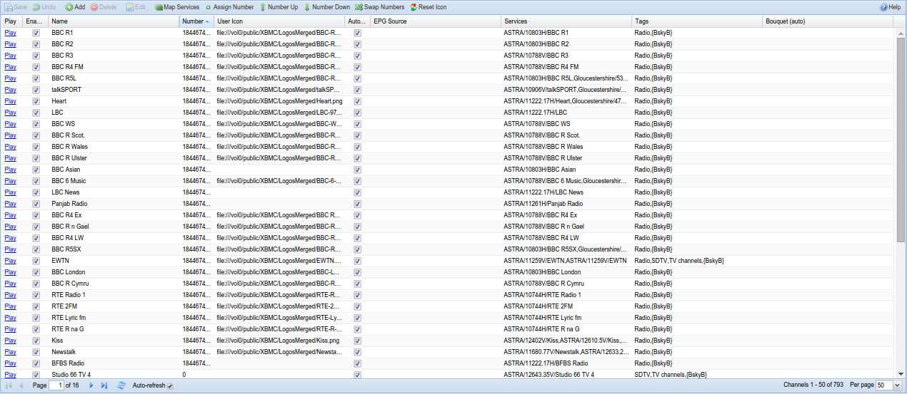

##Configuration - Channel/EPG - Channels

Display and edit channel configuration here.

---

####Menu Bar/Buttons

The following functions are available:

Button            | Function
------------------|---------
**Save**          | Save any changes made to the channel configuration.
**Undo**          | Undo any changes made to the channel configuration since the last save.
**Add**           | Add a new channel.
**Delete**        | Delete an existing channel. 
**Edit**          | Edit an existing channel. This allows you to change any of the parameters you’d otherwise set when adding a new channel, e.g. name, number, EPG source, tags, etc.
**Map Services**  | Map all services to channels. You will be prompted to include/exclude e.g. encrypted channels.
**Assign number** | Assign the lowest free channel number to the selected channel.
**Number Up**     | Increase by one the channel number for the selected channel. 
**Number Down**   | Decrease by one the channel number for the selected channel. 
**Swap Number**   | Swap the numbers over for the two selected channels.
**Reset Icon**    | Reset the icon URL for the selected channel.
**Help**          | Display this help page. 

---

####Grid Items

The main grid items have the following functions:

**Play**
: Play the relevant channel using HTTP streaming.

**Enabled**
: Whether or not the mux is enabled and thus available.

**Name**
: Name of the channel as presented in EPG and external interfaces.
  Changing name of a channel does not interfere with scheduled recordings,
  etc.

**Number**
: Channel number. This is not used by Tvheadend internally, but rather
  intended to be used by HTSP clients for mapping to remote control
  buttons, presentation order, etc

**User Icon**
: A URL pointing to an image representing the channel. The icon URL will
  be set automatically when importing data from XMLTV, when picon path is
  set or when channel icon path is set in the general config. This field
  allows the user to edit it manually. The reset icon action allows to
  re-set the automatic URL for selected channel (e.g. after configuration
  change).

**Icon URL**
: text

**Auto EPG Channel**
: Auto-link EPG channels from XMLTV and OpenTV EPG grabbers using the
  channel name for matching. If you turn this option off, only OTA EPG
  grabber will be used for this channel unless the EPG Grab Source option
  (below) is not set manually.

**EPG Grab Source**
: Name of the Internet-based EPG provider (typically XMLTV) channel that
  should be used to update this channels EPG info. By default Tvheadend
  tries to match the name itself, but sometimes it might not match
  correctly in which case you can do the mapping manually. When using
  XMLTV, a newly-mapped channel will not appear in the EPG until the next
  run of the grabber, or service restart.

Over-the-Air Sources

Over the air (OTA) sources do NOT need to be mapped in this way, the
linking is implicitly tied since they are all part of the DVB system.

   

**DVR Pre**
: Allows the user to specify an amount of extra time that should be
  prepended to a recording scheduled on this channel. In other words, if
  you type 5 here for a recording that is scheduled for 20:00 will start
  to record at 19:55. This setting overrides the Extra time before
  recordings DVR setting.

**DVR Post**
: Similar to DVR Pre-Start this allows the user to add an extra amount of
  time that should be appended to a recording. In other words, if you type
  5 here for a recording that is scheduled to end 20:30 will stop to
  record at 20:35. This setting overrides the Extra time after recordings
  DVR setting.

**Services**
: text

**Tags**
: Each channel can be bound to a zero, one or many tags. The tags are used
  for multiple things and it’s up to you how you wish to use and name
  them. Tags can be used to aid searching in the EPG if you have many
  channels. The tags are also presented in a Media player.

**Bouquet**
: text
