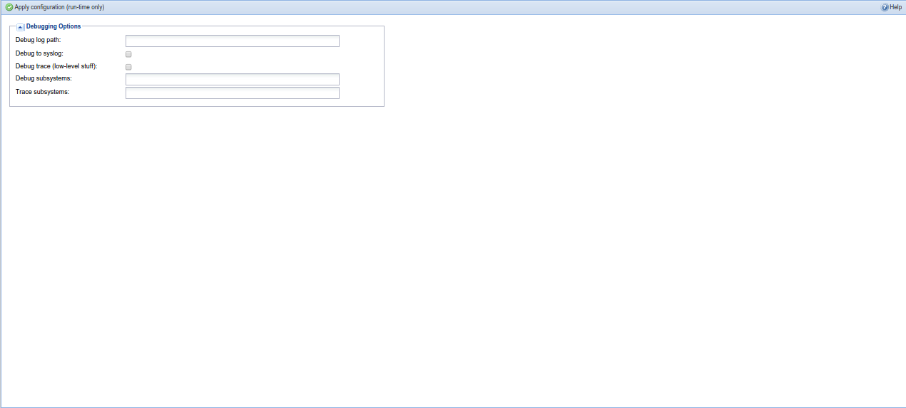

##Configuration - Debugging

This tab is used to configure various debugging options in tvheadend.

---

####Menu Bar/Buttons

The following functions are available:

Button     | Function
-----------|---------
**Apply Configuration (run-time only)** | Saves any changes made to the debugging configuration. Changes will be lost on a restart.
**Help** | Display this help page

---

####Configuration Options

**Debug log path**
: Text...   

**Debug to syslog**
: Text...   

**Debug trace (low-level stuff)**
: Text...   

**Debug subsystems**
: Text...   

**Trace subsystems**
: Text...   

Changes to any of these settings must be confirmed by pressing the ‘Save
configuration’ button before taking effect.

Note that settings are not saved to a storage. Any change is available only
while Tvheadend is running, and will be lost on a restart. To change the
default behaviour permanently, use command line options such as `-l`,
`–debug`, `–trace`.

Depending on your distribution, the default command-line configuration is
usually stored in the `/etc/sysconfig` tree or an init script. You may also
be able to change `/etc/default/tvheadend` to add additional command-line
parameters.
