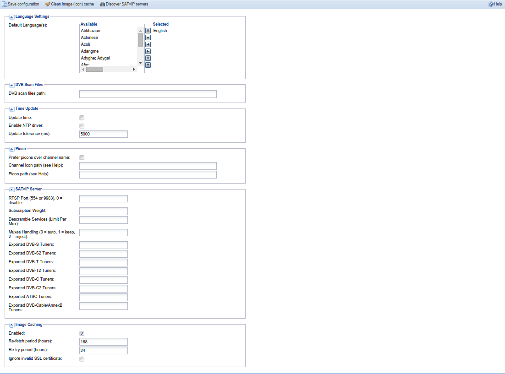

##Configuration - General

This tabs allow configuration of several general parameters that affect
the core Tvheadend functionality.

---

####Menu Bar/Buttons

The following functions are available:

Button                       | Function
-----------------------------|---------
**Save configuration**       | Save any changes to the current configuration.
**Clean image (icon) cache** | Clears the local channel icon cache, forcing images to be re-generated from sources (channel icons or picons).
**Discover SAT>IP servers**  | Forces a scan for any SAT>IP servers on the local network.
**Help**                     | Displays this help page

---

####Server

**Tvheadend server name**
: Set the name of the server so you can distinguish multiple instances apart
  on your LAN. 

####Language Settings

**Default Language(s)**
: Select the list of languages (in order of priority) to be used for
  supplying EPG information to clients that don’t provide their own
  configuration.
    
The EPG information is NOT translated, this only applies to EPG
providers that give information (titles, descriptions, etc..) in
multiple languages.

---

####DVB Scan Files Path

**DVB scan files path**
: Select the path to use for DVB scan configuration files. Typically
  dvb-apps stores these in `/usr/share/dvb/`. Leave blank to use Tvheadend's
  internal file set.

---

####Time Update
    
Tvheadend has a built-in capability to update the system time.
However, you should bear in mind that DVB time is not highly
accurate and is prone to both jitter and variation between different
transponders.
    
Where possible, it’s probably still better to use an internet based
NTP source to synchronise the system clock (i.e. through the
underlying operating system).

**Update time**
: Enable system time updates. This will only work if the user running
  Tvheadend has rights to update the system clock (normally only root).

**Enable NTP driver**
: This will create an NTP driver (using shmem interface) that you can
  feed into ntpd. This can be run without root privileges, but
  generally the performance is not that great.

**Update tolerance (milliseconds)**
: Only update the system clock (doesn’t affect NTP driver) if the
  delta between the system clock and DVB time is greater than this.
  This can help stop excessive oscillations on the system clock.

---

####Picons

Picons (from *p*ersonal *icons*) are collections of similar icons that
can be automatically matched against your channels based on a number
of technical parameters that will uniquely define a channel. The use
of these parameters (e.g. mux, frequency, orbital position) removes
the ambiguity of using names - it’s not case sensitive, it doesn’t
care if there are spaces or not, and so on. You can generate picons
yourself from existing images, or you can usually find sets pre-made
on the Internet if you search for them. They’re a good way to get
large numbers of icons matched quickly, and usually in a similar
style (such as square, x \* y pixels, with a consistent
highlight/reflection effect).

**Prefer picons over channel name**
: If both a picon and a channel-specific (e.g. channelname.jpg) icon
  are defined, use the picon.

**Channel icon path**
: Path to an icon for this channel. This can be named however you
  wish, as either a local (`file://`) or remote (`http://`) image. The following
  placeholders are available:
    
Placeholder | Function
:----------:| --------
**%C**      | The transliterated channel name in ASCII (safe characters, so `WDR Köln` will be `WDR Koln`). Spaces will be transliterated as is, so check that your filesystem can manage spaces in filenames.
**%c**      | The channel name (URL encoded ASCII)

Example: `file:///tmp/icons/%C.png` or `http://example.com/%c.png`

**Picon path**
: Path to a directory (folder) containing your picon collection. This
  can be named however you wish, as either a local (`file://`) or remote
  (`http://`) location - however, remember that it’s pointing to a
  directory as the picon names are automatically generated from the
  service parameters frequency, orbital position, etc.).

Example: `file:///home/hts/picons`

---

####SAT>IP Server

SAT>IP Server is something like DVB network tuner. Tvheadend can
forward mpegts input streams including on-the-fly descramling to SAT\>IP
clients.

Only networks with the “SAT>IP Source” field set are exported through
the SAT>IP protocol. This field is matched through the “src” parameter
asked from the SAT>IP client. Usually (and by default) this value is 1.
For satellite tuners, this value determines the satellite source (dish).
By specification position 1 = DiseqC AA, 2 = DiseqC AB, 3 = DiseqC BA, 4
= DiseqC BB, but any numbers may be used - depends on the SAT\>IP
client. Note that if you use a similar number for multiple networks, the
first matched network containing the mux with requested parameters will
win (also for unknown mux).

**RTSP Port**
: Select RTSP port (TCP) for realtime commands from SAT\>IP clients.
  Usually (as defined in the specification) this port is 554. But as
  extension, Tvheadend can use any TCP port value (which is default 9983
  for non-root users). But the SAT>IP client must allow to set this value
  (Tvheadend client will obtain the RTSP port number automatically using
  the XML description). If the RTSP port value is zero, the SAT\>IP server
  functionality is not enabled.

**Subscription Weight**
: Subscription weight value. Default value is 100 (standard streaming).
  Note that the default value for DVR is 300 (normal priority).

**Descramble Services**
: The maximum limit of services descrambled per a mux. If zero, the
  descrambling functionality is disabled.

**Muxes Handling**
: When SAT\>IP client requests new mux configuration, Tvheadend can handle
  it in three ways. The auto (0) configuration means that if the mux does
  not exists, a temporary mux is created and removed when the client
  closes the connection. The keep (1) configuration will remember all
  successfuly scanned muxes. The reject (2) configuration will reject
  unknown muxes.

**Exported .... Tuners**
: Each option lists the tuners, by type, you wish to present over IP to other clients.

---

####Image Caching

This will cache any channel icons or other images (such as EPG metadata)
to be served from the local webserver. This can be useful for
multi-client systems and, generally, to reduce hits on upstream
providers.

**Enabled**
: Select whether or not to enable caching. Note: even with this disabled
  you can still specify local (file://) icons and these will be served by
  the built-in webserver.

**Re-fetch period (hours)**
: How frequently the upstream provider is checked for changes.

**Re-try period (hours)**
: How frequently it will re-try fetching an image that has failed to be
  fetched.

**Ignore invalid SSL certificates**
: Ignore invalid/unverifiable (expired, self-certified, etc.) certificates
