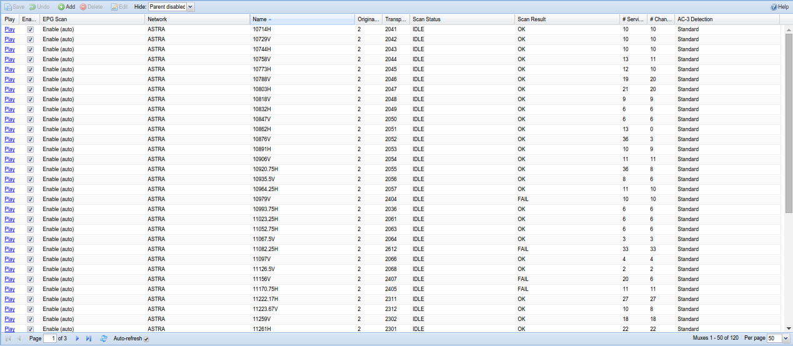

##Configuration - DVB Inputs - Muxes

Muxes are locations at which services can be found. On traditional
networks (DVB-C, -T and -S), these are carrier signals on which the
individual channels are multiplexed, hence the name. However, Tvheadend
also uses the term ‘mux’ to describe a source for multiple IP streams -
so an IP address, in effect.

---

####Menu Bar/Buttons

The following functions are available:

Button            | Function
------------------|---------
**Save**          | Save any changes made to the mux configuration.
**Undo**          | Undo any changes made to the mux configuration since the last save (changes are marked by a small red triangle).
**Add**           | Add a new mux.
**Delete**        | Delete an existing mux. 
**Edit**          | Edit an existing mux. This allows you to change any of the parameters you’d otherwise set when adding a new mux, e.g. delivery system, frequency, polarisation, etc.
**Hide <option>** | ??????. Options are Parent Disabled, All, None
**Help**          | Displays this help page. 

---

####Columns

The columns have the following functions:

**Play**
: Downloads a playlist file (M3U or XSPF, depending on your startup
  options) so you can tune to the mux from an external application.

**Enabled**:
  Whether or not the mux is enabled and thus available.

**EPG**:
  EPG scan setup

  * **Disable**:
  Disable the EPG scan

  * **Enable (auto)**:
  Enable the EPG scan (when some services from this mux are assigned to
channels)

  * **Force (auto)**:
  Force the EPG scan (everytime when the EPG scan is triggered)

  * **Only EIT**:
  Do only EIT EPG scan (when some services from this mux are assigned to
channels)

  * **Only UK Freesat**:
  Do only UK Freesat EPG scan (when some services from this mux are
assigned to channels)

  * **Only UK Freeview**:
  Do only UK Freeview EPG scan (when some services from this mux are
assigned to channels)

  * **Only Viasat Baltic**:
  Do only Viasat Baltic EPG scan (when some services from this mux are
assigned to channels)

  * **Only OpenTV Sky UK**:
  Do only OpenTV Sky UK EPG scan (the TSID must match in the skyuk
configuration file)

  * **Only OpenTV Sky Italia**:
  Do only OpenTV Sky Italia EPG scan (the TSID must match in the skyit
configuration file)

  * **Only OpenTV Sky Ausat**:
  Do only OpenTV Sky Ausat EPG scan (the TSID must match in the ausat
configuration file)

**Network**
: The name of the network to which the mux belongs. Networks are defined
  in *Configuration -> DVB Inputs -> Networks* - DVB-S or ATSC, for
  example.

**Original Network ID**
: The ONID is a code which uniquely identifies a network.

**Transport Stream ID**
: The TSID is a code which identifies the network origination source or
  transmitter.

**CRID Authority**
: The group responsible for the Content Reference Identifier for this mux. This is effectively a URL/URI to an authoritative source for programme
  data (e.g. series link).

**Scan Status**
: Whether the mux is being scanned (ACTIVE), is planned to be scanned
  (PEND) or has reverted to idle scan (IDLE).

**Scan Result**
: Whether there were any problems with the last scan of this mux.

**URL**
: Mux URL.

* **udp://**:
  Raw MPEG-TS UDP packets

* **rtp://**:
  MPEG-TS UDP packets with RTP header

* **http://**:
  HTTP stream (MPEG-TS)

* **https://**:
  Secure HTTP stream (MPEG-TS)

* **pipe://**:
  Read standard output from an external program. If the program name does
  not have a forward slash (`/`) as the first character, the PATH environment
  variable is used to find the program name in all directories specified by
  PATH. Additional arguments may be separated using spaces. A raw MPEG-TS 
  stream is expected. The string `${service\_name}` is substituted with the
  service name field contents. The backslash character (`\`) means “take
  the next character as-is” (usually space or the backslash itself - what's 
  termed "escaping" a character).

**# Services**
: The number of services found on this mux.

**Character Set**
: The character encoding for this mux (e.g. UTF-8).

**PMT Descriptor 0x06 = AC-3**
: Whether or not the empty PMT descriptor 0x06 defaults to the AC-3
  stream. Some Chinese cable providers are using this. If unsure, keep
  this off.

**Interface**
: IPTV : the network interface/card on which the IPTV source can be found.

**ATSC**
: Whether or not this is an ATSC IPTV source.

**Priority**
: IPTV : The mux priority value (higher value = higher priority to use
  services from this mux). Value 0 means use the IPTV network priority
  value.

**Streaming Priority**
: IPTV : The mux priority value for streamed channels through HTTP or HTSP
  (higher value = higher priority to use services from this mux). Value 0
  means use the standard streaming network priority value.

**Environment (pipe)**
: IPTV : List of environment variables for pipe (like PATH=/bin:/sbin)
  separated by spaces. The backslash character is handled like in URL.

**Respawn (pipe)**
: IPTV : Respawn the executed process when it dies.
