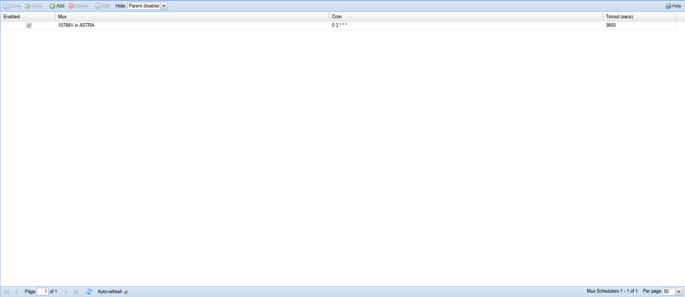

##Configuration - DVB Inputs - Mux Schedulers

Mux Schedulers enable Tvheadend to automatically play channels. This is
useful to get EPG, services or access rights updates.

---

####Columns:

The columns have the following functions:

**Enabled**
:   If selected, schedule will be triggered. If unselected, schedule will be
    ignored.

**Mux**
:   Select mux to be played from the available muxes.

**Cron**
:   Schedule frequency, using cron syntax.
    
Example : every day at 2am is `0 2 \* \* \*`

**Timeout**
:   Time in seconds the selected mux will be played.
    
Example : 1 hour would be `3600`
