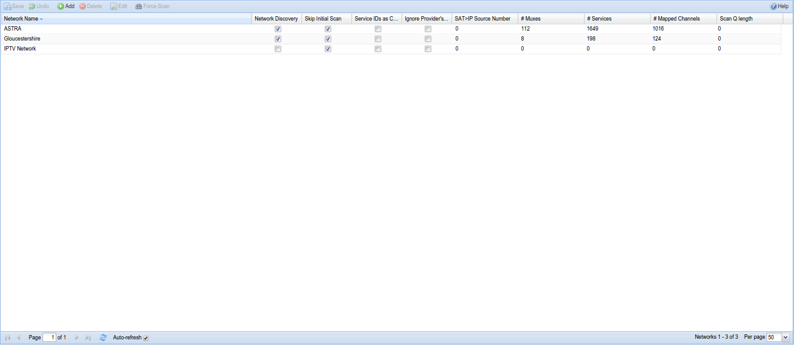

##Configuration - DVB Inputs - Networks

A network is the type of carrier for your television signals. Tvheadend
supports several different types of network, notably:

* **DVB-C** : Cable TV, delivered via a cable to your house

* **DVB-S** : Satellite (includes S2), so any signal coming in via a dish

* **DVB-T** : Terrestrial, so over-the-air broadcasts received through a
traditional television aerial

* **ATSC** : Over-the-air terrestrial, common in north and central America
and parts of south Asia

* **IPTV** : IP, so over the Internet

---

####Menu Bar/Buttons

The following functions are available:

Button         | Function
---------------|---------
**Save**       | Save any changes made to the network configuration.
**Undo**       | Undo any changes made to the network configuration since the last save (changes are marked by a small red triangle).
**Add**        | Add a new network. You can choose from any of the types described above.
**Delete**     | Delete an existing network. This will also remove any association with an adapter.
**Edit**       | Edit an existing network. This allows you to change any of the parameters you’d otherwise set when adding a new network, e.g. network discovery, idle scan, etc. - similar to using the check boxes to enable/disable functions.
**Force Scan** | Force a new scan (i.e. scan all muxes for services) for the selected networks.
**Help**       | Displays this help page. 

---

####Columns

The columns have the following functions:

**Network Name**:
The name of the network. This can be set automatically or you can give
it a name that means something to you (e.g. if you have multiple OTA
networks).

**Network Discovery**:
Whether automatic discovery is enabled for this network, i.e. whether
Tvheadend looks for muxes or simply stays with the list of muxes as
defined initially.

**Skip initial Scan**:
Don’t scan all muxes in this network at Tvheadend start. The initial
scan procedure is not a blind scan. Only known muxes registered to this
network are scanned. If Network Discovery is enabled and new muxes are
discovered using DVB descriptors, these muxes will be scanned too.

**Idle Scan Muxes**:
When nothing else happens Tvheadend will continuously rotate among all
muxes and tune to them to verify that they are still working when the
inputs are not used for streaming. If your adapter have problems with
lots of (endless) tuning, try to disable this. Note that this option
should be OFF for the normal operation. This type of mux probing is not
required and it may cause issues for SAT\>IP (limited number of PID
filters).

**Ignore Provider’s Channel Numbers**:
Some providers will try to set a channel number so that every receiver
is consistent - “tune to Channel x on 150”. This option allows you to
ignore this and let tvhheadend allocate a channel number itself.

**Max Input Streams**:
IPTV : maximum simultaneous streams that can be played.

**Max Bandwidth**:
IPTV : maximum bandwidth allowed for streams.

**Max timeout**:
IPTV : maximum timeout trying to play stream.

**Network ID**:
If you experience problems caused by overlaps between multiple network
providers this option can be used to filter which network ID is received
by a given adapter.

**Ignore Provider’s Channel Numbers**:
Do not use the local channel numbers defined by provider.

**SAT\>IP Source Number**:
This field is matched through the “src” parameter asked from the SAT\>IP
client. Usually (and by default) this value is 1. For satellite tuners,
this value determines the satellite source (dish). By specification
position 1 = DiseqC AA, 2 = DiseqC AB, 3 = DiseqC BA, 4 = DiseqC BB, but
any numbers may be used - depends on the SAT\>IP client. Note that if
you use same number for multiple networks, the first matched network
containing the mux with requested parameters will win (also for unknown
mux). If this field is set to zero, the network cannot be used by the
SAT\>IP server.

**EIT Local Time**:
EPG (EIT) events uses local time instead UTC.

**Character Set**:
The character encoding for this network (e.g. UTF-8).

**Priority**:
IPTV : The network priority value (higher value = higher priority to use
muxes/services from this network).

**Streaming Priority**:
IPTV : The network priority value for streamed channels through HTTP or
HTSP (higher value = higher priority to use muxes/services from this
network). If not set, the standard network priority value is used.
