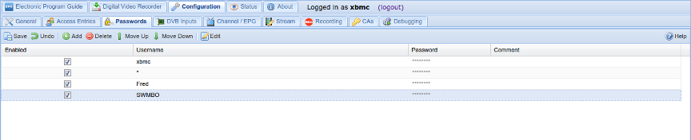

##Configuration - Passwords

This tab is the second part of Tvheadend's access control mechanism. It is
where you set and maintain all user passwords (e.g. for streaming or DVR access).

---

####Menu Bar/Buttons

The following functions are available:

Button         | Function
---------------|---------
**Save**       | Save any changes made to the password rules.
**Undo**       | Undo any changes made to the password rules since the last save.
**Add**        | Add a new password rule.
**Delete**     | Delete the selected password rule.
**Move up**    | Move the selected rule up one level (rules are executed top to bottom).
**Move down**  | Move the selected rule down one level (rules are executed top to bottom).
**Edit**       | Edit the selected password rule.
**Help**       | Display this help page.

---

####Grid Items

The main grid items have the following functions:

<tvhversion till="4.0">
**Password**
: Login password to be used. If username is `*` (unused), the password
should be the same (i.e. match any username/password combination, or no
username/password required).
</tvhversion>
