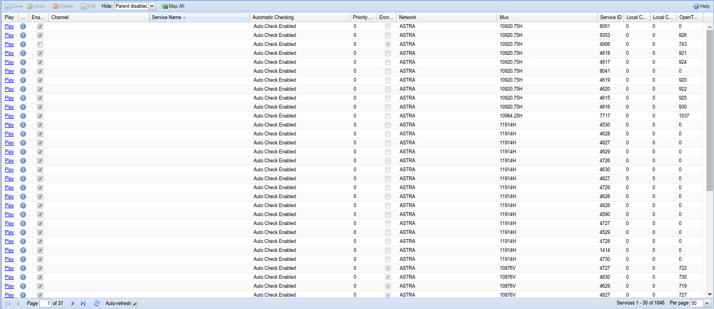
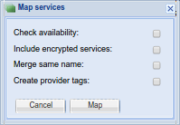

##Configuration - DVB Inputs - Services

Services are automatically pulled from muxes and can be mapped to
Channels.

---

####Menu Bar/Buttons

The following functions are available:

Button             | Function
-------------------|---------
**Save**           | Save any changes made to the services.
**Undo**           | Undo any changes made to the services since the last save.
**Delete**         | Delete an existing service. 
**Edit**           | Edit an existing service.
**Hide <option\>** | ??????. Options are Parent Disabled, All, None
**Map all**        | Map all services to channels. You will be prompted to include/exclude e.g. encrypted channels.
**Help**           | Displays this help page. 

---

####Map All Dialog

If you select the 'Map All' function, the following dialog box appears and
allows you to fine-tune the mapping of services to channels:

Options here are:

**Check availability**
: If checked, only services that are available now will be mapped (so, for
  example, time-sharing channels will not be mapped if they're currently
  off air).

**Include encrypted services**
: If checked, encrypted services will be included in the mapping. Leave
  unchecked to exclude these from your channel list.
  
**Merge same name**
: If checked, merge identically-named services from multiple sources into
  single channels.
  
**Create provider tags**
: If checked, automatically create Tvheadend channel tags to match any tags
  provided by the broadcaster.
  
---

####Grid Items

The main grid items have the following functions:

**Play**
: Opens a playlist (M3U of XSPF, depending on your startup options) to
  allow you to stream this service to another application, e.g. to watch a
  channel in VLC.

**Details**
: Display details on this service, e.g. PID, streams, audio/video CODECs,
  languages, etc.

**Enabled**
: Whether or not this service is available for use

**Channel**
:  Text...

**Service Name**
:  Text...

**Automatic Checking**
: Check for the service presence. If service is no longer broadcasted,
  this field will become as “Missing In PAT/SDT”. The check can be also
  disabled for given service using this column.

**Priority (1-10)**
: Define priority (range -10..10) for this service. The higher value means
  more preferred. Note that this value is *added* to the input (tuner)
  priority. Take this in account when you set the input priorities.

**Channel**
: The channel to which the service is mapped

**Service Name**
: The name of the service, detected when the service was discovered

**Encrypted**
: Whether or not the service is scrambled

**CAID**
:  Text...

**Network**
: The network on which this service resides (i.e. whether it’s a cable
  channel or a terrestrial one)

**Mux**
: The mux which carries this service. This is typically the frequency of
  the carrier signal in kHz, with polarisation (H or V) as applicable.

**Mux UUID**
:  Text...

**Service ID**
: A unique identifier for this service within this mux/transport stream.

**Local Channel Number**
: Channel number as assigned by the broadcaster.

**Local Channel Minor**
:  Text...

**OpenTV Channel Number**
:  Text...

**Provider**
: Any supplied provider string, e.g. where multiple broadcasters share a
  platform, such as for free-to-air and pay TV.

**CRID Authority**
: The group responsible for the Content Reference Identifier for this
  service. This is effectively a URL/URI to an authoritative source for
  programme data (e.g. series link).

**Service Type**
: The service type flag as defined by the DVB specifications (e.g. 0x02 =
  radio, 0x11 = MPEG2 HD TV, 0x19 = H.264 HD TV)

**Ignore EPG (EIT)**
:  Text...

**Character Set**
: The character encoding for this service (e.g. UTF-8).

**Pref. CA PID**
: The Preferred Conditional Access Packet Identifier. Used for decrypting
  scrambled streams.

**Lock Pref. CA PID**
: The locking mechanism selection for The Preferred Conditional Access
  Packet Identifier.

* **Off**
: Automatic Preferred Conditional Access Packet Identifier selection.

* **On**
: Keep Preferred Conditional Access Packet Identifier selection (no 
  automatic modifications allowed).

**Force CA ID (e.g. 0x2600)**
:  Text...

**Created**
:  When the service was first identified and recorded.

**Last Seen**
:  Whenthe service was last seen during a mux scan.
