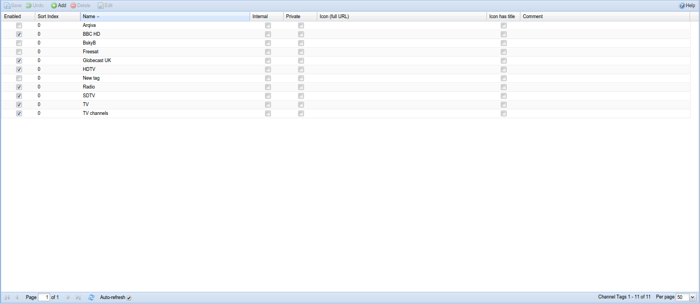

##Configuration - Channel/EPG - Channel Tags

This tab is used to configure channel tags. Tags are used to define a
set of channels. Notice that nothing prohibits a channel to be a member
of multiple tags. 

---

The tag-sets are used for:

* Searches in the EPG.

* Display of channel groups in Kodi, Movian and similar.

Note that there is no requirement to use tags for Tvheadend itself, but they
are required for Movian. Using tags also simplifies sorting/filtering your
channels on the Tvheadend web interface and in tag-aware applications such as Kodi

The tags are listed / edited in a grid.

* To edit a cell, double click on it. After a cell is changed it will
  flags one of its corner to red to indicated that it has been
  changed. To commit these changes back to Tvheadend press the ‘Save
  changes’ button. In order to change a Checkbox cell you only have to
  click once in it.

* To add a new entry, press the ‘Add entry’ button. The new (empty)
  entry will be created on the server but will not be in its enabled
  state. You can now change all the cells to the desired values, check
  the ‘enable’ box and then press ‘Save changes’ to activate the new
  entry.

* To delete one or more entries, select the lines (by clicking once on
  them), and press the ‘Delete selected’ button. A pop up will ask you
  to confirm your request.

---

####Menu Bar/Buttons

The following functions are available:

Button              | Function
--------------------|---------
**Add entry**       |
**Delete selected** |
**Save changes**    |

---

####Columns

The columns have the following functions:

**Enabled**
: Make the tag available in the rest of the system. If the tag is not
  enabled it is only presented in this grid for the administrator.

**Name**
: Name of the tag. Changing the tag name does not interfere with any
  automatic recordings, groups, etc.

**Internal**
: Tags are exported via HTSP/HTTP and used there for grouping of TV
  channels. If you do not wish to export a tag you can flag it as internal
  only.

**Private**
: Tags are exported via HTSP/HTTP and used there for grouping of TV
  channels. If you do not wish to export a tag to other users you can flag
  it as private only. Only users with this tag configured in the access
  configuration (or users with not set tags) can use it.

**Icon**
: Full path to an icon used to depict the tag. This can be a TV network
  logotype, etc.

**Icon has title**
: If set, presentation of the tag icon will not superimpose the tag name
  on top of the icon.

**Comment**
: Allows the administrator to set a comment only visible in this editor.
  It does not serve any active purpose.
