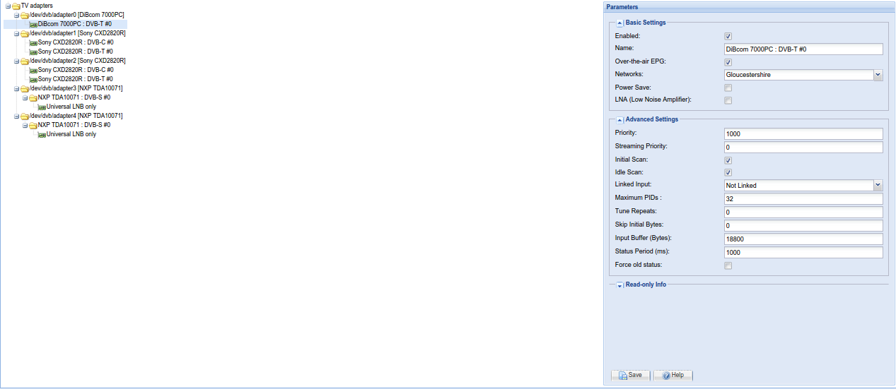

##Configuration - DVB Inputs - TV Adapters

The adapters and tuners are listed and edited in a tree.

---

####Menu Bar/Buttons

The following functions are available:

Button         | Function
---------------|---------
**Save**       | Save the current TV adapter configuration.
**Help**       | Display this help page.

---

####Basic Settings

**Enabled**
: If selected, this tuner/adapter will be enabled and will become
  available to receive broadcasts or programmes.

**Name**:
: The name of this tuner.

**Over-the-Air EPG**
: Enable over-the-air programme guide (EPG) scanning on this input
  device.

**Networks**
: Associate this device with one or more networks.

---

####Advanced Settings

**Priority**
: The tuner priority value (a higher value means to use this tuner out
  of preference).

**Streaming Priority**
: The tuner priority value for streamed channels through HTTP or HTSP
  (a higher value means to use this tuner out of preference). If not set
  (zero), the standard priority value is used.

**Init Scan**
: Allow the initial scan tuning on this device (scan when Tvheadend
  starts). See *Skip Initial Scan* in the network settings for further
  details.

**Idle Scan**
: Allow idle scan tuning on this device.

**Linked Input**
: Wake up the linked input whenever this adapter is used. The subscriptions
  are named as “keep”. *Note that this isn't normally needed, and is here
  simply as a workaround to driver bugs in certain dual tuner cards that 
  otherwise lock the second tuner*.

---

####LinuxDVB Specific Rows

**Power Save**
: If enabled, allows the tuner to go to sleep when idle.

**Tune Before DiseqC**
: If set, one tune request (setup) is sent before the DiseqC
  sequence (voltage, tone settings). Some linux drivers require this
  procedure.

**Tune Repeats**
: Number of repeats for the tune requests (default is zero - no repeats).
  *Note: this represents the number of repeats, not the number of requests -
  so 0 means 'send once: don't repeat', 1 means 'send twice: send once, 
  then send one repeat', etc.*

**Skip Initial Bytes**
: If set, the first bytes from the MPEG-TS stream are discarded. It may be
  required for some drivers or hardware which do not flush completely
  the MPEG-TS buffers after a frequency/parameter change.

**Input Buffer (Bytes)**
: By default, linuxdvb's input buffer is 18800 bytes long. The accepted
  range is 18800-1880000 bytes.

**Status Period**
: By default, linuxdvb's status read period is 1000ms (one second). The
  accepted range is 250ms to 8000ms. Note that for some hardware or
  drivers (like USB), the status operations take too much time and
  CPU. In this case, increase the default value. For fast hardware,
  this value might be decreased to make the decision of the re-tune
  algorithm based on the signal status faster.

**Force old status**
: Always use the old ioctls to read the linuxdvb status (signal
  strength, SNR, error counters). Some drivers are not mature enough
  to provide the correct values using the new v5 linuxdvb API.

---

####LinuxDVB Satellite Config Rows

**DiseqC repeats**
: Number of repeats for the DiseqC commands (default is zero - no DiseqC
  repeats). *Note: this represents the number of repeats, not the number
  of requests - so 0 means 'send once: don't repeat', 1 means 'send twice:
  send once, then send one repeat', etc.*

**Full DiseqC**
: Always send the whole DiseqC sequence including LNB setup (voltage,
  tone). If this is not checked, only changed settings are sent, which may
  cause issues with some drivers. If the tuning is not reliable, try
  activating this option.

**Turn off LNB when idle**
: Turn off LNB when it is not used. It may save some power.

**Switch Then Rotor**
: If the DiseqC switch is located before the rotor (i.e. tuner - switch -
  rotor), enable this.

**Init Rotor Time (seconds)**
: Upon start, Tvheadend doesn't know the last rotor position. This value
  defines the initial rotor movement. TVHeadend waits the specified time
  when the first movement is requested.

**Min Rotor Time (seconds)**
: The minimum delay after the rotor movement command is send.

---

####SAT>IP Specific Rows

**Full Mux Rx mode supported**
: Enable if the SAT>IP box supports the full mux rx mode (`pids=all`)

**Signal scale (240 or 100)**
: Some SAT>IP boxes only report a 0-100 (percentage) signal strength.
  If your signal strength reports as too low, try setting this to 100.

**Maximum PIDs**
: Maximum supported PIDs in the filter of the SAT>IP box.

**Maximum length of PIDs**
: Maximum length in characters for the command setting PIDs to the
  SAT>IP box.

**Addpids/delpids supported**
: Enable if the SAT>IP box supports the `addpids`/`delpids` commands.

**PIDs in setup**
: Enable if the SAT>IP box requires `pids=0` parameter in the SETUP
  RTSP command.

**Double RTSP Shutdown**
: Enable if the SAT>IP box might require to send twice the RTSP
  SHUTDOWN command.

**Force pilot for DVB-S2**
: Enable if the SAT>IP box requiest plts=on parameter in the SETUP
  RTSP command for DVB-S2 muxes.

**UDP RTP Port Number (2 ports)**
: Force the local UDP Port number here. The number should be even (RTP
  port). The next odd number (+1) will be used as the RTCP port.

**Satellite Positions**
: Select the number of satellite positions supported by the SAT>IP
  hardware and your coaxial cable wiring.

**Master Tuner**
: Select the master tuner.

  > The signal from the standard universal LNB can be split using a
  > simple coaxial splitter (no multiswitch) to several outputs. In this
  > case, the position, the polarization and low-high band settings must
  > be equal. 
    
  > If you set other tuner as master, then this tuner will act like a
  > slave one and tvheadend will assure that this tuner will not use
  > incompatible parameters (position, polarization, lo-hi).

**Next tune delay in ms (0-2000)**
: The minimum delay before tuning in milliseconds after tuner stop. If the
  time between the previous and next start is greater than this value
  then the delay is not applied.

**Send full PLAY cmd**
: Send the full RTSP PLAY command after full RTSP SETUP command. Some
  device firmware require this to get an MPEG-TS stream.

**Override tuner count**
: Force Tvheadend to see a specific number of tuners.

  > Some devices, notably AVM’s FRITZ!Box Cable 6490, report wrong number of tuners
  > and this setting allows you to override that. Any value below 1 or
  > above 32 is ignored. For now this setting requires a restart of
  > tvheadend.

**PIDs 21 in setup**
: Enable if the SAT>IP box requires `pids=21` parameter in the SETUP
  RTSP command.

**Force teardown delay**
: Force the delay between RTSP TEARDOWN and RTSP SETUP command (value
  from ‘Next tune delay in ms’ is used). Some devices are not able to
  handle quick continuous tuning.

**Tuner bind IP address**
: Force all network connections to this tuner to be made over the
  specified IP address, similar to the setting for the SAT>IP device
  itself. Setting this overrides the device-specific setting.
