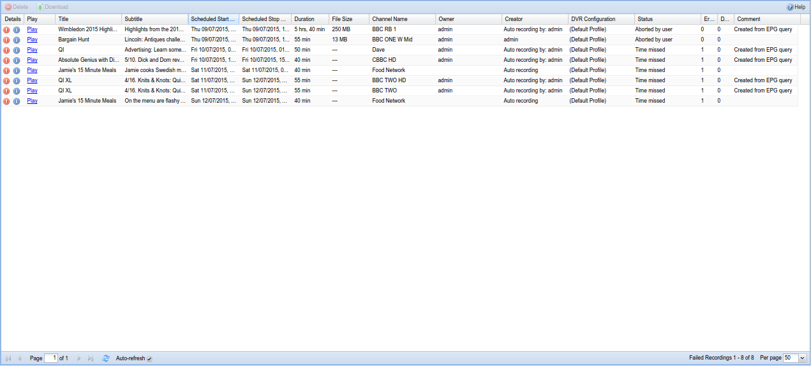
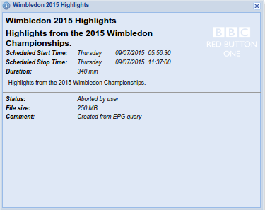

##Digital Video Recorder - Failed Recordings

This tab show all failed recordings.

---

####Menu Bar/Buttons

The following functions are available:

Button       | Function
-------------|----------
**Delete**   | Delete the selected finished recording records **<u>and associated files</u>**. You will be prompted for confirmation.
**Download** | Download the selected finished recordings to local disk. You will be prompted to select the path for the saved file(s).
**Help**     | Display this help page.

---

####Grid Items

The main grid items have the following functions:

**Details**
: Shows the status of the recording event:

Icon                                       | Description
-------------------------------------------|-------------
 | the recording has failed
 | click to display detailed information about the selected recording

The detailed information dialog is as follows:

**Play**
: Play the selected recording in your browser via the VLC Plugin or some
  other external player (dependent on there being enough of the failed
  recording to play, of course).

**Title**
: The title of the recording.

**Subtitle**
: Text...

**Episode**
: The episode number of the record.

**Scheduled Start Time**
: The date and time when the recording was started.

**Scheduled Stop Time**
: The date and time when the recording was stopped.

**Duration**
: The total duration of the recording.

**File Size**
: The size of the recording file on disk.

**Channel Name**
: The name of the channel from which the recording was made.

**Owner**
: Text...

**Creator**
: The name of the user who created the recording.

**DVR Configuration**
: The DVR configuration to be used for this recording.

**Status**
: Status information on the failure (e.g. *file missing*).

**Schedule Status**
: The status of the recording (failed).

**Errors**
: Text...

**Data Errors**
: Text...

**URL**
: The URL of the recording.

**Comment**
: Text...
