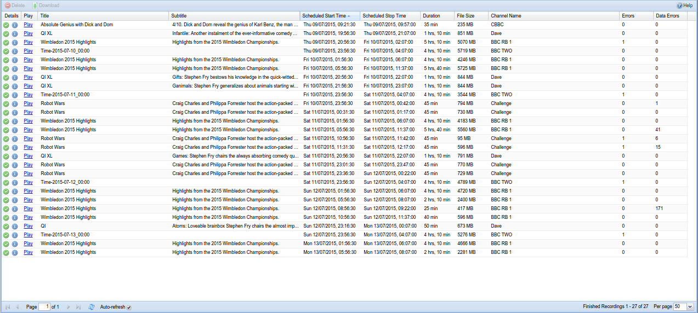
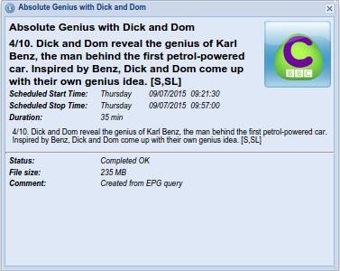

##Digital Video Recorder - Finished Recordings

This tab shows your all finished recordings.

---

####Menu Bar/Buttons

The following functions are available:

Button       | Function
-------------|----------
**Delete**   | Delete the selected finished recording records **<u>and associated files</u>**. You will be prompted for confirmation.
**Download** | Download the selected finished recordings to local disk. You will be prompted to select the path for the saved file(s).
**Help**     | Display this help page.

---

####Columns

The columns provide the following functions:

**Details**
: Displays a green tick 'completed' status and a blue information (“i”) icon. 
  Click on the information icon to see further information about the selected
  recordings.

The columns also provide the following details:

**Play**
: Play the selected recording in your browser via the VLC Plugin or some
  other external player.

**Title**
: The title of the recording.

**Episode**
: The episode number of the record.

**Scheduled Start Time**
: The date and time when the recording was started.

**Scheduled Stop Time**
: The date and time when the recording was stopped.

**Duration**
: The total duration of the recording.

**File Size**
: The size of the recording file on disk.

**Channel Name**
: The name of the channel from which the recording was made.

**Creator**
: The name of the user who created the recording.

**Schedule Status**
: The status information of the recording.

**URL**
: The URL of the recording.
