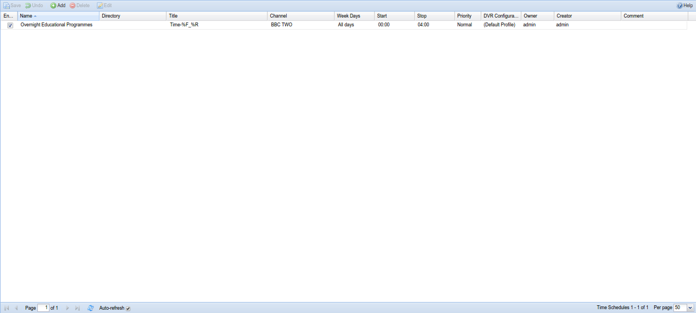

##Digital Video Recorder - Time Schedules

This tab is used to create and maintain Digital Video Recorder rules.
These can be EPG-driven (such as those created from the initial EPG tab)
through the DVR AutoRec Entries tab , or can be timer-based through the
Time Schedules tab.

This tab controls timer-driven recording rules.
 

---

####Menu Bar/Buttons

The following functions are available:

Button     | Action
---------- | -------
**Save**   | Save any changes made to the recording rule list.
**Undo**   | Undo any changes made to the recording rules list since the last save.
**Add**    | Add and configure a recording rule - define the channel, schedule, DVR configuration, priority, etc.
**Delete** | Delete an existing recording rule.
**Edit**   | Manually edit an existing recording rule. This uses the same fields as Add, but they’re pre-populated with their current values.
**Help**   | Display this help page.

---

####Grid Items

The main grid items have the following functions:

**Enabled**
: Check or clear this box to enable or disable this rule.

**Name**
: The name you’ve given to the rule, e.g. ‘Evening cartoons for the
children’.

**Directory**
: When specified, this setting overrides the subdirectory rules specified
by the DVR configuration and puts all recordings done by this entry into
the specified subdirectory. 

> Useful for e.g. recording multiple different
> news broadcasts into one common subdirectory called “News”.

**Title**
: The title is used in the filename that is created for the recording.

> The default format string suggests **Time-\[date\]\_\[time\]**.

> The escape-codes use
[strftime](http://man7.org/linux/man-pages/man3/strftime.3.html) format.

Examples:

String | Format Result
------ | -------------
%F     | The date in ISO-format (e.g. 2015-02-28)
%R     | The time in 24h HH:MM format (e.g. 19:45)
%x     | The date, formatted according to your locale settings

**Channel**
: The channel on which this rule applies, i.e. the channel you’re aiming
to record.

**Week Days**
: On which specific days of the week you wish this rule to be active (e.g.
*only record channel XXX at xx:yy on Saturdays and Sundays*).

**Start**
: Start recording at this time.

**Stop**
: Stop recording at this time.

**Priority**
: The priority of any recordings set because of this rule: in descending 
priority, values are *important*, *high*, *normal*, *low*, and *unimportant*.
Higher-priority events will take precedence and cancel lower-priority events.

**DVR Configuration**
: The DVR configuration (e.g. extra start/stop time, post-processing
rules) to be used for any recordings set because of this rule.

**Owner**
: Text...

**Creator**
: Text...

**Comment**
: A free-text comment. Not used otherwise.
